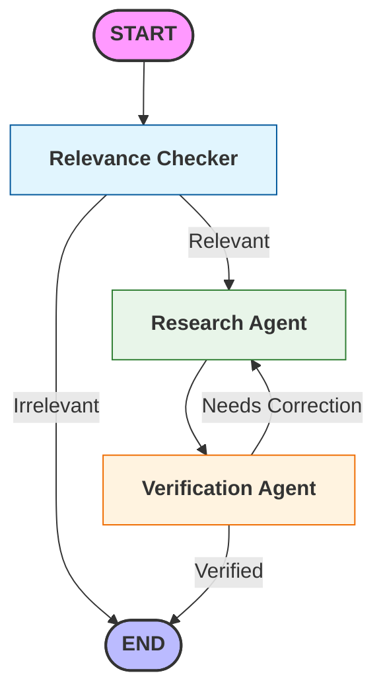

> **A high-precision RAG system designed to bridge the "Hallucination Gap" in technical document audit.**

---

  
  
  
  
  

  
  
  

  
  
  

---

## 🎖️ The Inspiration: From Defense Analysis to Data Science
During my time as a **Cost Analyst for the U.S. Air Force**, I navigated the "Document Maze"—thousands of hours spent auditing dense technical proposals, program descriptions, and complex contract policy manuals. In high-stakes defense environments, missing a single footnote in a 500-page document isn't just an inconvenience; it can lead to multi-million dollar discrepancies.

I built **DocChat** because I knew there was a better way to ensure 100% accuracy without the human burnout. This tool moves beyond simple "Chat-with-PDF" wrappers to create a system that **thinks like an analyst**: verifying its own claims and handling complex layouts that traditional AI often fails to parse.

---

## 🚀 The Industry Problem: Why I Built This
Generic AI often fails in specialized sectors like Defense, Finance, or Law because it lacks **rigor**. I built **DocChat** because I knew there was a better way to ensure 100% accuracy without the human burnout. I moved beyond a simple "Chat-with-PDF" wrapper to create a system that **thinks like an analyst**:

* **Trust, but Verify:** Just as an analyst cross-references sources, DocChats’ **Verification Agent** checks every AI claim against the original source text.
* **Context is King:** Using **Docling**, I ensured the AI understands table structures and complex layouts—elements where standard RAG systems usually break.
* **The "Full-Stack" Advantage:** By deploying this on **Modal** with a **Dual-LLM (Gemini/OpenAI) failover**, I’ve demonstrated the ability to take a high-level business need and turn it into a resilient, scalable, and cost-effective cloud application.

---

## 🏗️ Architecture & Engineering
This project is a full-stack engineering demonstration of how to build and deploy a heavy RAG pipeline on serverless infrastructure.

### **The Multi-Agent Orchestration**
Instead of a linear prompt, the app utilizes a **LangGraph-driven state machine** that mimics a human research workflow:
1. **The Research Agent:** Conducts a **Hybrid Search** (BM25 + Vector) to find relevant data.
2. **The Verification Agent:** Cross-checks every generated claim against the original source text to eliminate hallucinations.
3. **The Self-Correction Loop:** Automatically triggers a re-run of the research phase if unsupported statements are detected.

### **Technical Infrastructure**
* **Serverless Intelligence:** Deployed on **Modal**, utilizing Infrastructure-as-Code (IaC) to manage GPU resources and custom container environments.
* **Layout-Aware Parsing:** Implemented **IBM Docling** to treat PDFs as visual structures, ensuring the AI understands multi-column tables and headers that standard parsers merge into "text soup."
* **Reliability Engineering:** Developed a **Dual-LLM Failover** strategy using **Gemini 2.5 Flash** as the primary engine and **GPT-4o-mini** as an automatic fallback.

---

## 🛠️ Tech Stack
* **Orchestration:** LangGraph
* **LLMs:** Gemini 2.5 Flash, OpenAI GPT-4o-mini
* **Data Engineering:** IBM Docling, RapidOCR, ChromaDB
* **Infrastructure:** Modal (Serverless Cloud), Python 3.12, Gradio (UI)


  
