> **A high-precision RAG system designed to bridge the "Hallucination Gap" in technical document audit.**

---

  
  
  
  
  

  
  
  

  
  
  

---

# 📊 Project: LLM Spreads (Proof of Concept)

### **The Inspiration: Solving the "70/30" Problem**
During my time as a **Credit Analyst** in the banking industry, I experienced a frustrating reality: roughly **70% of my time** was spent on the manual transcription of financial data from PDFs into spreading software. This left only **30% of my time** for the actual analysis—the part of the job that adds real value to the company and requires human judgment.

I built **LLM Spreads** as a proof of concept to solve this "70/30" problem. The goal is to automate the tedious data entry phase, allowing analysts to focus on what they do best: evaluating risk and identifying opportunities.

---

### **Project Scope & Transparency**
> ⚠️ **Disclaimer: Prototype Version**
> This project is a **small-scale demonstration** of how Generative AI can be applied to financial workflows. While the pipeline is fully operational, it was fine-tuned on a limited dataset of **29 high-quality examples**. 
>
> In an institutional setting, this would require a dataset of 500+ documents to handle all possible reporting edge cases. This project serves as a showcase of my ability to **design agentic workflows, fine-tune Large Language Models (LLMs) on Vertex AI, and deploy serverless AI applications.**

---

### **Technical Highlights**

```mermaid
graph TD
    Start([<b>User Uploads PDF</b>]) --> Parsing[<b>Docling Parsing</b>]
    Parsing --> Security{<b>🛡️ Security Agent</b>}
    
    Security -- "Unsafe" --> Alert([<b>Stop & Alert</b>])
    Security -- "Safe" --> Financial[<b>🔍 Financial Agent</b>]
    
    Financial --> Verification[<b>🧐 Verification Agent</b>]
    
    Verification --> Output([<b>✅ Structured JSON Output</b>])

    style Start fill:#f9f,stroke:#333,stroke-width:2px
    style Parsing fill:#e1f5fe,stroke:#01579b
    style Security fill:#ffcdd2,stroke:#c62828
    style Alert fill:#b71c1c,stroke:#333,stroke-width:2px,color:#fff
    style Financial fill:#e8f5e9,stroke:#2e7d32
    style Verification fill:#fff3e0,stroke:#ef6c00
    style Output fill:#bbf,stroke:#333,stroke-width:2px
```

* **Custom Fine-Tuning**: I performed Supervised Fine-Tuning (SFT) on **Gemini 2.0 Flash** via Vertex AI to ensure the model adheres to strict financial schemas and specific accounting formatting.
* **Agentic Verification Architecture**: The app doesn't just "guess." It uses a linear multi-agent flow:
    1.  **🛡️ Security Agent**: Scans for prompt injections or malicious input.
    2.  **🔍 Financial Agent**: Performs the core extraction using the tuned model.
    3.  **🧐 Verification Agent**: Acts as a "Senior Editor," checking the extraction against the source text and correcting errors in real-time.
* **High-Fidelity Parsing**: Utilizes the **Docling** library to accurately parse complex, multi-column financial tables into clean Markdown before processing.
* **Serverless Deployment**: The final application is built with **Streamlit** and deployed via **Modal**, showcasing a scalable, production-ready deployment strategy.

---

### **The Results**
Even with a small training set, the tuned model (**spreads_llm2**) showed measurable improvements in output formatting and style consistency compared to the base model.

| Metric | Base Gemini 2.0 | Tuned Model (`spreads_llm2`) |
| :--- | :---: | :---: |
| **Schema Adherence** | 10.00 | 10.00 |
| **Accounting Logic** | 9.80 | 9.80 |
| **Format & Style** | 9.64 | **9.68** |

---

### **What’s Next?**
This demo lays the groundwork for more complex financial automation, including:
* **Business Tax Returns**: Expanding the schema to handle IRS Forms 1120 and 1065.
* **Scaling the Lab**: Increasing the training set to 500+ examples for institutional robustness.
* **Granular Spreading**: Automating more complex items like EBITDA adjustments and debt schedules.


  

